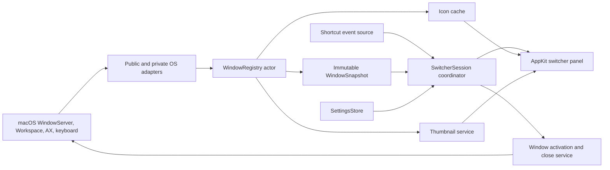

# Tab-List — Complete Implementation Plan

> Target release: Tab-List 1.0
> Repository: <https://github.com/haagjjan/Tab-List>
> Status: decision-complete implementation and release specification

## Implementation Record — July 30, 2026

The repository now contains the 1.0 implementation candidate described by this
document:

- Swift 6 core models, filtering, MRU ordering, settings migration, layout, and
  a deterministic switcher state machine.
- Native AppKit/SwiftUI app shell, onboarding, settings, menu-bar controls,
  global shortcut input, immutable window registry, Accessibility operations,
  capability-checked WindowServer integration, three presentation modes,
  in-memory thumbnails, persistent app-icon caching, and redacted diagnostics.
- A window-fixture application, core/app/UI test targets, original application
  icon assets, XcodeGen project, legal/privacy documentation, and GitHub Actions
  automation for CI, signing, notarization, packaging, Sparkle appcasts, and
  release publication.

Source-level validation on the current Apple Silicon development host passes:

- Swift 6 complete-concurrency compilation with warnings treated as errors.
- arm64 linking for the core library, application, and fixture sources against
  the macOS 15 deployment target.
- Swift Package Manager core build.
- XcodeGen 2.46.0 deterministic project generation.
- Plist, JSON, YAML, shell syntax, release metadata, asset, and dependency-pin
  checks.

This is not yet a signed 1.0 release. The following acceptance gates require
external state that is unavailable on the current host and must be completed
before publishing:

- Install and select full Xcode 26.x, then execute the real XCTest and UI-test
  suites. Command Line Tools alone do not contain the XCTest runtime.
- Run the manual macOS 15/macOS 26 compatibility matrix with Accessibility and
  Screen Recording permission combinations, multiple Spaces/displays, Stage
  Manager, fullscreen windows, minimized windows, and the supported app matrix.
- Empirically validate unsupported WindowServer ABIs. Space queries, exact
  activation, and AX-to-WindowServer ID mapping are
  enabled only for exact Darwin builds recorded in the project-owned
  compatibility allowlists after their fixture matrices and structural runtime
  probes pass. Private notification, remote-AX, and hardware-capture symbols
  remain detected but disabled until their calling conventions pass the same
  process; public reconciliation and ScreenCaptureKit remain the safe
  fallbacks.
- Validate or implement the isolated macOS 15 hardware-capture backend before
  claiming minimized/off-Space thumbnail parity there. The current candidate
  intentionally uses ScreenCaptureKit only and surfaces compatibility mode
  rather than invoking the detected `SLSHWCaptureWindowList` symbol with an
  unverified calling convention.
- Measure every latency, CPU, and memory budget in an optimized Release build.
- Configure Developer ID, notarization, and Sparkle EdDSA secrets; run the
  protected release workflow; and pass Gatekeeper plus update-from-beta tests on
  a clean Mac.

These are release-validation gates, not permission to weaken the acceptance
criteria below. A private symbol being present is never sufficient reason to
invoke an unverified ABI.

## 1. Product Definition

### Vision

Tab-List is a lightweight native macOS menu-bar utility that replaces the application-level `Command-Tab` experience with switching between individual macOS windows.

If Firefox has three windows, all three appear independently. Browser tabs are not enumerated; the active browser tab normally appears naturally through that window’s macOS title.

### Locked decisions

| Area | Decision |
|---|---|
| Platform | macOS 15 or later |
| Architecture | Apple Silicon (`arm64`) only |
| Distribution | Direct download, Developer ID signed and notarized |
| Store | No Mac App Store build |
| License | MIT, independently implemented |
| Application style | Menu-bar accessory app with no normal Dock icon |
| Default shortcut | `Command-Tab`; `Shift-Command-Tab` reverses |
| Candidate windows | Standard windows from all Spaces and displays |
| Ordering | Window-level most-recently-used order |
| Panel location | Display containing the mouse pointer |
| Presentation modes | Thumbnails, App Icons, and Titles |
| Default mode | Thumbnails |
| Close behavior | Delete or close button closes only the selected window |
| Cancellation | Escape restores the pre-switch state |
| Search | Not included |
| Other actions | No minimize, maximize, fullscreen, or app-quit actions |
| Shortcut profiles | One configurable shortcut |
| Filters | Core Space/screen/state filters and per-app exclusions |
| Updates | Sparkle 2.9.4 through GitHub Releases |
| Telemetry | None |
| Localization | English in 1.0, all strings localization-ready |

### Success criteria

Tab-List 1.0 is complete when it:

- Reliably lists and activates individual windows from supported apps, including windows on other Spaces, other displays, minimized windows, hidden apps, and fullscreen Spaces.
- Shows one selectable item per macOS window in all three presentation modes. App-icon mode must not collapse several windows into one app item.
- Preserves the fast-switching model: press `Command-Tab`, cycle, and release Command to activate.
- Never persists window screenshots to disk.
- Requires Screen Recording only for thumbnail mode; icon and title modes continue working without it.
- Runs near-idle while hidden and remains responsive with at least 100 windows.
- Ships as a signed, notarized, updateable public release with tests, documentation, privacy disclosures, and reproducible release automation.

### Performance budgets

Measure these in an optimized Release build on a base Apple Silicon Mac:

- Cached overlay appearance: P95 below 75 ms from shortcut event to visible panel.
- Selection movement: completed inside one 16 ms frame.
- Current-Space window activation: normally below 250 ms.
- Cross-Space activation: below 750 ms excluding macOS’s Space animation.
- Idle CPU: average below 0.5% over five minutes with no window activity.
- Icon/title mode memory: below 60 MB with 50 windows.
- Thumbnail mode memory: below 200 MB with 50 windows.
- Thumbnail image cache: hard limit of 128 MiB.
- Capture work must stop or become idle within one second after dismissing the panel.

### Explicit non-goals

Version 1.0 will not include:

- Individual Safari, Firefox, or Chrome browser-tab enumeration.
- Browser extensions or browser-specific automation.
- Type-to-search.
- Multiple shortcut profiles.
- Gestures.
- Window minimize, maximize, or fullscreen controls.
- Quitting or force-quitting applications.
- Apps with no open windows.
- Cloud sync, accounts, analytics, crash-report uploads, or advertising.
- Intel support or macOS 14 support.
- App Store compatibility.
- Copying AltTab source, assets, wording, reverse-engineered constants, or visual branding. AltTab is GPL-3.0; Tab-List must remain an original clean-room MIT implementation inspired only by its behavior and the supplied reference screenshots.

## 2. Functional and Experience Specification

### First-run flow

1. Launch as an accessory/menu-bar app and open a native welcome window.
2. Explain that Tab-List observes keyboard input and controls other apps’ windows locally.
3. Request Accessibility permission using `AXIsProcessTrustedWithOptions`.
4. Poll permission status and provide a button to open the correct Privacy & Security pane.
5. Explain that Screen Recording is optional and used only to create window thumbnails.
6. Offer:
   - **Enable Thumbnails**, which requests Screen Recording.
   - **Continue without previews**, which selects Title mode.
7. If Screen Recording was newly granted and macOS requires a restart, offer a one-click quit-and-reopen action.
8. Confirm `Command-Tab`, provide a test interaction, then close onboarding.
9. Do not enable Launch at Login without an explicit user choice.

Accessibility permission is mandatory for shortcut interception, exact activation, and close actions. Screen Recording must not block icon/title modes. Apple documents the AX trust prompt through [`AXIsProcessTrustedWithOptions`](https://developer.apple.com/documentation/applicationservices/1459186-axisprocesstrustedwithoptions) and requires a clear `NSScreenCaptureUsageDescription` for [ScreenCaptureKit](https://developer.apple.com/documentation/screencapturekit) use.

### Switcher session behavior

The session is a strict state machine:

```text
idle → preparing → visible/cycling → committing | cancelling → idle
```

#### Opening

- Register the configured trigger globally, defaulting to `Command-Tab`.
- On the first press:
  - Snapshot the currently focused app/window.
  - Obtain the latest immutable window registry snapshot.
  - Apply settings filters and exclusions.
  - Sort by window-level MRU.
  - Select the second MRU item so one `Command-Tab` switches to the previous window.
  - Present the panel on the display containing the pointer.
- Show cached data immediately. Do not wait for fresh thumbnails.
- If only the current window is available, do nothing.
- If no eligible windows exist, do not show an empty panel.

#### Cycling

- Further `Tab` presses advance one item and wrap at the end.
- Holding Shift reverses direction.
- Key repeat uses the system repeat cadence without an additional artificial timer.
- Releasing the configured hold modifier activates the selected window.
- A mouse click on a tile or row activates that window immediately.
- Mouse hover may reveal controls but must not unexpectedly change the keyboard selection.

#### Cancelling

- Escape consumes the switcher input, dismisses the panel, and preserves the originally focused window.
- Releasing Command after Escape must not activate the currently highlighted item.
- Closing Settings, disconnecting a display, losing Accessibility permission, or encountering an invalid registry snapshot must fail closed by cancelling the session.

#### Closing a window

- A selected/hovered item exposes a small `xmark.circle.fill` control labelled **Close window**.
- Delete performs the same action.
- Closing means the selected window’s normal AX close action, not terminating the owning application.
- After a successful close:
  - Keep the panel open.
  - Remove the window.
  - Select the next item at the same index, or the previous item if the closed item was last.
- If no candidates remain, dismiss the panel.
- If the app displays an unsaved-document sheet or another confirmation dialog, dismiss Tab-List and activate that app so the user can answer it.
- If a window is not closable or its AX element cannot be resolved, hide/disable the close control and provide a tooltip. Delete should produce a subtle system beep instead of terminating the app.

### Candidate-window rules

Include by default:

- Standard application/document windows.
- Minimized windows.
- Windows belonging to hidden applications.
- Fullscreen windows and windows on fullscreen Spaces.
- Windows on every display and Space.
- Untitled standard windows when their owning app and geometry indicate a real user window.

Exclude:

- Tab-List’s own overlay, settings, onboarding, and permission windows.
- Dock, Desktop, menu-bar, wallpaper, tooltip, popover, menu, notification, and drag-image windows.
- Utility palettes, invisible helper windows, zero-sized windows, and transparent compositor surfaces.
- Apps with no user windows.
- Inactive browser tabs.
- Inactive tabs in macOS-native tab groups; the visible container is one window item.

Filtering must be based on role/subrole, WindowServer layer and attributes, geometry, owning process, visibility state, and a small set of documented app-specific exceptions. Do not filter solely by title.

### MRU behavior

- Maintain a monotonically increasing focus sequence per window.
- Update MRU only when a window actually becomes focused, not whenever all windows from an activated app are ordered forward.
- Seed the initial order from current WindowServer z-order, placing off-Space windows after known visible windows until real focus events establish their order.
- Never persist window IDs or MRU order across launches because window IDs are ephemeral.
- Opening, closing, minimizing, restoring, Space switching, tab switching, and app activation must update the registry without reversing sibling-window MRU order.

### Presentation modes

Every mode uses the same filtered `SwitcherItem` collection and selection state.

#### Thumbnail mode

- One tile per window.
- Aspect-fit preview without cropping.
- Show the app icon, app name, and current window title.
- Browser windows show the active web-tab title when the browser exposes it as the macOS window title.
- Show a restrained minimized/fullscreen badge where applicable.
- Selected tile receives a 3-point accent-colored outline and subtle fill.
- Close control appears on hover or keyboard selection.
- Missing/denied captures use the app icon and title as a graceful fallback.

#### App Icons mode

- One tile per window, including repeated icons for multiple windows from the same app.
- Use a large app icon with app name and window title beneath it.
- Do not request or refresh window thumbnails.
- Distinguish same-app windows through title text and selection order.

#### Titles mode

- One compact row per window.
- Use a small app icon, app name, and window title.
- Keep app name visually stronger than title.
- Truncate at the end and expose the full title through a tooltip and accessibility label.
- Do not request or refresh window thumbnails.

### Visual specification

Use a native AppKit overlay rather than a web-style surface:

- Borderless, nonactivating `NSPanel`.
- Centered within the pointer display’s `visibleFrame`.
- `NSVisualEffectView` using an appropriate HUD/menu material.
- System, Light, and Dark appearance choices.
- Default opacity: 88%.
- Default size: Auto.
- Maximum height: 72% of the active display’s visible frame.
- Outer padding: 16 points.
- Item gap: 12 points.
- Panel corner radius: 16 points.
- Selection radius: 12 points.
- Close control: at least a 24×24-point hit target.
- Overflow uses a native scroll view; the selected item must scroll into view.

Size presets:

| Preset | Panel width | Thumbnail target | Icon tile | Title row |
|---|---:|---:|---:|---:|
| Small | min(620 pt, 60% display) | 240×160 pt | 120 pt wide | 40 pt |
| Medium | min(900 pt, 75% display) | 300×200 pt | 148 pt wide | 48 pt |
| Large | min(1200 pt, 90% display) | 360×240 pt | 176 pt wide | 56 pt |
| Auto | Smallest preset keeping the collection within three rows where possible | Derived | Derived | Derived |

Honor Reduce Transparency, Reduce Motion, Increase Contrast, VoiceOver, keyboard focus visibility, and system accent color. With Reduce Transparency enabled, replace the material with an opaque semantic system background.

### Settings

Use a native SwiftUI settings window hosted by AppKit.

#### Appearance

- Presentation: Thumbnails / App Icons / Titles.
- Size: Small / Medium / Large / Auto.
- Theme: System / Light / Dark.
- Opacity: 70–100%.
- Live sample preview.
- Resource disclosure:
  - Thumbnails: “Uses Screen Recording and keeps a bounded in-memory preview cache.”
  - App Icons: “Low resource use; app icons are cached.”
  - Titles: “Lowest resource use; no window content is captured.”

#### Controls

- One shortcut recorder.
- Default and reset action.
- Validation preventing:
  - Shortcut conflicts.
  - A modifier-only trigger.
  - Shift as the only base modifier because Shift is reserved for reverse cycling.
- Transactional changes: register the new shortcut first; keep the old shortcut if registration fails.

#### Filtering

- Spaces: All Spaces / Visible Spaces.
- Screens: All Screens / Pointer Screen.
- Show minimized windows: on by default.
- Show hidden-app windows: on by default.
- Show fullscreen windows: on by default.
- MRU is fixed and not exposed as an alternative ordering.

#### Exceptions

- Exclude complete applications by bundle identifier.
- Add from currently running apps or an application file picker.
- Display icon, localized name, bundle identifier, and bundle path.
- Remove/re-enable without losing unrelated preferences.

#### General

- Launch at login: off by default.
- Show menu-bar icon: on by default.
- Refresh thumbnails in background: off by default.
- Automatically check for updates: on by default.
- Check for Updates.
- Open Permissions.
- Export Diagnostics.
- Reset settings.

#### About

- Version/build.
- MIT license.
- GitHub link.
- Privacy summary.
- Acknowledgement that AltTab inspired the interaction, without bundling AltTab assets or code.

### Menu-bar menu

- Open Settings.
- Temporarily Disable Tab-List.
- Permission status.
- Check for Updates.
- About Tab-List.
- Quit Tab-List.

Disabling or quitting must immediately unregister shortcuts and return native `Command-Tab` behavior.

## 3. Technical Architecture

### Project foundation

Create a standard macOS application with:

- Swift 6.2 and strict concurrency enabled.
- AppKit for the switcher, keyboard handling, window/server integration, and menu bar.
- SwiftUI for onboarding and Settings.
- macOS deployment target 15.0.
- `arm64` architecture only.
- No storyboard.
- Hardened Runtime enabled.
- App Sandbox disabled.
- `LSUIElement = true`.
- Bundle identifier `com.haagjjan.TabList`.
- Display name `Tab-List`; executable/target name `TabList`.
- `NSScreenCaptureUsageDescription`: “Tab-List captures scaled previews of open windows when Thumbnail mode is enabled.”
- Sparkle 2.9.4 pinned through Swift Package Manager.
- An XcodeGen `project.yml` as the target/build-setting source of truth, with the generated `.xcodeproj` committed for contributors who do not use XcodeGen.
- App, unit-test, UI-test, and window-fixture targets.

The initial development machine has Command Line Tools but not the full Xcode application. Full Xcode 26.x must be installed and selected before project generation validation, UI tests, archives, signing, or notarization.

### Component flow



### Major modules

#### App shell

Owns:

- Application lifecycle.
- `NSStatusItem`.
- Settings/onboarding windows.
- Launch-at-login integration.
- Permission status.
- Updater startup.
- Sleep/wake and screen-lock handling.

#### WindowServer bridge

A narrow internal module owns every unsupported/private symbol. No raw private types or functions may escape this module.

Capabilities:

- Enumerate windows across Spaces.
- Query Space membership.
- Receive window create/destroy/focus/order/geometry events.
- Activate an exact window by process and WindowServer ID.
- Capture minimized/off-Space windows where public capture fails.
- Resolve an AX element for an off-Space window when possible.

Resolve private symbols dynamically through `dlopen`/`dlsym`, supporting the relevant `SLS`/legacy aliases. Never force-unwrap a symbol. Perform a harmless startup self-test and expose a capability set rather than a single success flag.

Candidate private entry points include:

- `SLSMainConnectionID`
- `SLSCopyManagedDisplaySpaces`
- `SLSCopyWindowsWithOptionsAndTags`
- `SLSCopySpacesForWindows`
- `SLSRegisterConnectionNotifyProc`
- `_SLPSSetFrontProcessWithOptions`
- `SLSSpaceSetFrontPSN`
- `SLSHWCaptureWindowList`
- `_AXUIElementGetWindow`
- `_AXUIElementCreateWithRemoteToken`

Implement these contracts independently; do not transplant AltTab wrappers or constants. Validate notification identifiers empirically on macOS 15 and 26 with the fixture app and document them in Tab-List’s own compatibility tests.

If a capability fails:

- Do not crash.
- Fall back to `CGWindowListCopyWindowInfo`, `SCShareableContent`, `NSWorkspace`, and AX enumeration.
- Limit degraded cross-Space behavior where necessary.
- Show a non-blocking compatibility warning in Settings/menu bar.
- Keep current-Space switching operational.

#### Accessibility bridge

Responsibilities:

- Check/request Accessibility trust.
- Obtain application/window AX elements.
- Read role, subrole, title, minimized/fullscreen state, close button, and focused window.
- Map AX elements to `CGWindowID`.
- Raise, unminimize, and close windows.
- Resolve off-Space elements lazily and cache them only for the lifetime of the owning process.

All AX IPC runs off the main thread with bounded messaging timeouts. Use per-process serialization so one unresponsive app cannot block every other app. Treat `cannotComplete`, `invalidUIElement`, and unsupported attributes separately.

#### Window registry

The registry is an actor and the single source of truth.

```swift
struct WindowKey: Hashable, Sendable {
    let pid: pid_t
    let windowID: CGWindowID
}

struct WindowRecord: Identifiable, Sendable {
    let id: WindowKey
    let bundleIdentifier: String?
    let applicationName: String
    let bundleURL: URL?
    var windowTitle: String
    var bounds: CGRect
    var spaceIDs: [UInt64]
    var displayID: CGDirectDisplayID?
    var isMinimized: Bool
    var isHidden: Bool
    var isFullscreen: Bool
    var isStandardWindow: Bool
    var isClosable: Bool
    var lastFocusSequence: UInt64
}

struct WindowSnapshot: Sendable {
    let generation: UInt64
    let windows: [WindowRecord]
    let visibleSpaceIDs: Set<UInt64>
    let createdAt: ContinuousClock.Instant
}
```

Do not store `AXUIElement`, `NSImage`, `SCWindow`, or other non-Sendable framework objects in `WindowRecord`. Keep those handles in their owning actors keyed by `WindowKey`.

Registry inputs:

- Initial WindowServer reconciliation.
- NSWorkspace app launch/terminate/activate/hide/unhide events.
- WindowServer lifecycle/focus/order/Space events.
- AX reads where WindowServer metadata is insufficient.
- Display configuration, Space, sleep/wake, and screen-lock events.
- A throttled full reconciliation at startup, wake, display changes, Space changes, and immediately before opening the switcher if the snapshot is stale.

Publish immutable snapshots. Never let the UI query WindowServer or AX directly.

#### Shortcut and input service

Use:

- Carbon `RegisterEventHotKey` for the configurable trigger.
- A minimal Core Graphics event tap for modifier-release, repeated Tab, Shift direction, Escape, and Delete.
- A dedicated CFRunLoop thread.
- An active event filter only while a switcher session is open; remain listen-only otherwise where possible.

The event-tap callback must do no AppKit work, allocation-heavy work, AX work, or WindowServer queries. It translates the event to a small Sendable command and dispatches it to the main actor.

Re-enable a tap if macOS disables it after timeout, sleep, lock, or heavy load. If registration fails, preserve native keyboard behavior. Apple documents the event-tap permission model through [`CGEvent.tapCreate`](https://developer.apple.com/documentation/coregraphics/cgevent/tapcreate%28tap%3Aplace%3Aoptions%3Aeventsofinterest%3Acallback%3Auserinfo%3A%29).

#### Switcher session coordinator

Main-actor object owning:

- State machine.
- Original focus.
- Session snapshot generation.
- Filtered MRU list.
- Selection and wraparound.
- Keyboard/mouse commands.
- Commit/cancel/close transitions.
- Refreshing the visible list after registry events.
- Cancellation of stale capture work.

It consumes protocols rather than concrete OS services:

```swift
protocol WindowSnapshotProviding {
    func snapshot(forceRefreshIfStale: Bool) async -> WindowSnapshot
}

protocol WindowActuating {
    func activate(_ key: WindowKey) async -> WindowActionResult
    func close(_ key: WindowKey) async -> WindowActionResult
}

protocol ThumbnailProviding {
    func cachedThumbnail(for key: WindowKey) async -> CGImage?
    func refresh(_ keys: [WindowKey], priority: [WindowKey]) async
}

protocol AppIconProviding {
    func icon(for bundleID: String?, bundleURL: URL?) async -> NSImage
}
```

#### Exact activation service

Activation sequence:

1. Verify the record still belongs to the same PID and window ID.
2. Unminimize through AX if required.
3. Use the private exact-window activation capability to front only the selected window and switch to its Space.
4. Raise the resolved AX element within the owning app.
5. Use public app activation as a fallback.
6. Verify the selected window became focused.
7. Retry once with a fresh AX element if the cached element is stale.
8. Return a typed result; never silently report success.

On public fallback paths, use modern cooperative activation APIs where possible. Apple changed activation behavior in macOS 14 and deprecated unconditional focus stealing, so exact activation cannot rely exclusively on `NSRunningApplication.activate` ([AppKit macOS 14 release notes](https://developer.apple.com/documentation/macos-release-notes/appkit-release-notes-for-macos-14)).

#### Thumbnail service

Only instantiate or invoke this service in Thumbnail mode.

Balanced strategy:

- Never persist window content.
- Retain scaled previews in `NSCache`.
- `totalCostLimit = 128 MiB`.
- `countLimit = 120`.
- Use the tile’s actual backing-scale target instead of capturing full-resolution windows.
- Show cached frames immediately.
- At invocation, refresh in this order:
  1. Selected item.
  2. Previous and next item.
  3. Remaining visible tiles.
  4. Offscreen items if the session remains open.
- Maximum three simultaneous captures.
- Coalesce duplicate requests per window.
- Associate requests with registry/session generations and discard stale results.
- Cancel pending low-priority work when the panel closes.
- The optional background-refresh setting may refresh changed visible windows at a heavily throttled rate; it is off by default.

Capture backends:

- macOS 26+: prefer `SCScreenshotManager` with a desktop-independent `SCContentFilter`.
- macOS 15: use the isolated WindowServer capture backend for reliability and minimized/off-Space windows, with public ScreenCaptureKit fallback.
- If capture fails, retain the previous frame or show the icon placeholder.

Apple’s `SCScreenshotManager` is the public single-frame API, and `SCContentFilter(desktopIndependentWindow:)` captures an individual window ([SCScreenshotManager](https://developer.apple.com/documentation/screencapturekit/scscreenshotmanager), [single-window filter](https://developer.apple.com/documentation/screencapturekit/sccontentfilter/init%28desktopindependentwindow%3A%29)).

#### Icon cache

- Obtain icons from `NSRunningApplication.icon` or `NSWorkspace`.
- Keep an in-memory cache and a persistent cache under `Library/Caches/com.haagjjan.TabList/AppIcons`.
- Key entries by bundle identifier, canonical bundle path, bundle version, and modification date.
- Store normalized PNG representations at required scales.
- Refresh when an app is first observed, launched, updated, or its bundle fingerprint changes.
- Do not globally watch Downloads or scan the filesystem continuously.
- Icon/title modes must not initialize ScreenCaptureKit or request Screen Recording.

#### Switcher panel

Use AppKit and layer-backed views:

- `NSPanel` with `.borderless` and `.nonactivatingPanel`.
- Window collection behavior suitable for all Spaces/fullscreen auxiliary display.
- Panel stays out of Mission Control and standard window cycling.
- `NSCollectionView` with a diffable data source for thumbnail and icon grids.
- `NSTableView` or list-configured collection view for Title mode.
- Reuse cells and update only changed items.
- Use CALayer-backed thumbnail rendering.
- Do not make Tab-List the active application merely to show the panel.
- Make every item an accessibility element with app name, title, state, position, and selected status.

`canJoinAllSpaces` and fullscreen auxiliary behavior are provided by AppKit’s [`NSWindow.CollectionBehavior`](https://developer.apple.com/documentation/appkit/nswindow/collectionbehavior-swift.struct).

#### Settings persistence

Use a versioned Codable schema stored in `UserDefaults`, with migrations:

```swift
struct SettingsV1: Codable, Sendable {
    var presentation: PresentationMode
    var panelSize: PanelSize
    var theme: ThemePreference
    var opacity: Double
    var shortcut: ShortcutDefinition
    var spaceScope: SpaceScope
    var screenScope: ScreenScope
    var includeMinimized: Bool
    var includeHiddenApps: Bool
    var includeFullscreen: Bool
    var excludedBundleIdentifiers: Set<String>
    var refreshThumbnailsInBackground: Bool
    var showMenuBarIcon: Bool
    var automaticallyChecksForUpdates: Bool
}
```

Keep login-item state in `SMAppService`, not duplicated as assumed truth in preferences. Use `SMAppService.mainApp.register()`/`unregister()` and surface `requiresApproval` correctly ([SMAppService documentation](https://developer.apple.com/documentation/servicemanagement/smappservice)).

### Privacy and security

- No analytics or automatic crash upload.
- No window screenshots on disk.
- Window titles must be redacted from normal logs.
- Diagnostics export must require an explicit action and default to hashed bundle identifiers and redacted titles.
- Network access is limited to Sparkle update checks.
- Store no credentials.
- Release secrets remain only in GitHub Actions secrets.
- Hardened Runtime remains enabled.
- App Sandbox remains off because of global input, AX control, and private WindowServer integration.
- Permission revocation during runtime must stop affected services and show actionable status.
- Lock screen and sleep must suspend capture and clear active sessions.
- Memory-pressure events must purge thumbnail caches immediately.

## 4. Implementation and Release Work

### Phase 0 — Development prerequisites

- Install full Xcode 26.x, accept its license, and select it with `xcode-select`.
- Confirm Swift 6.2, macOS 15 deployment SDK support, code signing, and `xcodebuild`.
- Add `.gitignore` for `.DS_Store`, DerivedData, build products, local signing config, and release secrets.
- Preserve the two reference screenshots as design evidence; do not bundle them into the app.
- Create the first commit before implementation begins.

Exit criterion: an empty signed Debug accessory app builds and launches from `xcodebuild`.

### Phase 1 — Project and pure core

- Create XcodeGen configuration and targets.
- Add MIT license, README, privacy policy, contributing guide, security policy, and this plan.
- Implement settings schema, filtering, MRU ordering, window classification, layout calculation, and session reducer as pure testable logic.
- Define OS adapter protocols and typed errors/results.
- Add `os.Logger` categories and signposts with privacy-redacted values.

Exit criterion: pure-core unit tests pass without requiring Accessibility or Screen Recording.

### Phase 2 — Permissions and window registry

- Implement onboarding and live permission state.
- Implement public inventory and private WindowServer capability bridge.
- Build initial enumeration, Space/display mapping, app lifecycle, focus tracking, and reconciliation.
- Add bounded AX lookup and window discrimination.
- Build the fixture application with standard, untitled, modal, utility, minimized, fullscreen, and native-tabbed windows.
- Validate private APIs independently on macOS 15 and 26.

Exit criterion: a debug inspector displays the correct eligible windows, Space/display assignments, states, and MRU changes without thumbnails.

### Phase 3 — Shortcut, session, activation, and close

- Register and replace `Command-Tab`.
- Implement modifier-release detection, reverse cycling, Escape cancellation, and Delete.
- Implement exact current-Space and cross-Space activation.
- Implement close with stale-element retry and confirmation-dialog handling.
- Re-enable taps after sleep/wake or timeout.
- Ensure native `Command-Tab` returns when Tab-List is disabled or quits.

Exit criterion: keyboard-only switching and closing works across Finder, TextEdit, Safari, Firefox, Chrome, and one Electron app.

### Phase 4 — Three visual modes and caching

- Implement nonactivating panel and native material.
- Build thumbnail grid, app-icon grid, and title list.
- Implement size/theme/opacity options.
- Add persistent icon cache and bounded in-memory thumbnail cache.
- Add progressive priority capture and graceful placeholders.
- Add mouse selection and close controls.
- Complete VoiceOver and reduced-motion/transparency behavior.

Exit criterion: all three modes pass snapshot and interaction tests at every size/theme setting.

### Phase 5 — Settings and menu-bar completion

- Implement Appearance, Controls, Filtering, Exceptions, General, and About sections.
- Add shortcut conflict validation.
- Implement login launch through `SMAppService`.
- Add reset settings, permissions links, diagnostics export, and temporary disable.
- Ensure relaunching the app opens Settings if the menu-bar icon was disabled.

Exit criterion: every setting persists, migrates, updates live where appropriate, and has an automated or explicit manual test.

### Phase 6 — Updates and public packaging

- Integrate Sparkle 2.9.4 with EdDSA-signed appcasts.
- Stable feed: `https://github.com/haagjjan/Tab-List/releases/latest/download/appcast.xml`.
- Build signed `.app`, Sparkle `.zip`, and user-facing `.dmg`.
- Enable Developer ID signing, secure timestamp, and Hardened Runtime.
- Notarize with `xcrun notarytool`, staple tickets, and validate with `codesign` and `spctl`.
- GitHub Actions release workflow:
  - Build and test.
  - Import signing identity from secrets.
  - Archive arm64 Release.
  - Sign, notarize, staple, and package.
  - Generate/sign the appcast.
  - Publish artifacts to a GitHub Release.
  - Never expose certificate, notarization, or Sparkle private keys in logs.

Apple requires Developer ID signing, Hardened Runtime, and notarization for trustworthy direct distribution ([Developer ID](https://developer.apple.com/developer-id/), [notarization workflow](https://developer.apple.com/documentation/security/notarizing-macos-software-before-distribution)).

Exit criterion: a clean Mac can download the DMG, pass Gatekeeper, grant permissions, switch windows, and install an in-app update.

### Phase 7 — Compatibility hardening and rollout

- Test macOS 15 and current macOS 26 on Apple Silicon.
- Run a private alpha, then a GitHub pre-release beta.
- Treat a new macOS major version as unsupported until the private bridge self-tests pass.
- On unverified systems, use capability detection and public fallbacks rather than version-number assumptions.
- Add an issue template that collects OS/build, app version, permission state, display/Space configuration, and redacted diagnostics.
- Promote 1.0 only after the release acceptance matrix passes twice from fresh installs.

## 5. Test Plan and Acceptance Matrix

### Unit tests

Cover:

- Window classification and rejection rules.
- Browser-window titles without browser-tab enumeration.
- All/current Space and all/pointer-screen filters.
- Minimized, hidden, fullscreen, and excluded-app behavior.
- Window-level MRU updates and app-activation storms.
- Session state transitions.
- Forward/reverse wraparound.
- Escape after any selection.
- Modifier release after cancellation.
- Close-selection replacement logic.
- Shortcut validation and failed transactional updates.
- Panel-size and grid-column calculations.
- Settings defaults, encoding, migration, and reset.
- Icon fingerprinting/invalidation.
- Thumbnail prioritization, coalescing, generation checks, and eviction.
- Missing private-symbol capability fallbacks.
- AX timeout, stale element, and unresponsive app outcomes.
- Log redaction.

### Integration tests

Use the fixture app and real system apps to test:

- Multiple windows belonging to one app.
- Several windows with identical titles.
- Empty and very long titles.
- Native macOS tab groups showing one visible container.
- Minimized, hidden, fullscreen, modal, utility, and unclosable windows.
- Create, close, move, resize, minimize, restore, and retitle while the panel is open.
- App launch and termination.
- Cross-Space activation.
- Multiple displays with different scaling and pointer locations.
- Display connect/disconnect during a session.
- Stage Manager on and off.
- “Displays have separate Spaces” on and off.
- Sleep/wake, lock/unlock, and fast user switching.
- Accessibility and Screen Recording granted, denied, skipped, and revoked.
- A hung or AX-incomplete application.
- Secure Input and alternate keyboard layouts.
- Keyboard repeat and rapid `Command-Tab` bursts.
- Window close producing an unsaved-document prompt.
- Screen Recording denied while changing among all three modes.
- Update from the previous signed beta to the current release.

### UI and accessibility tests

- Snapshot each presentation mode in System/Light/Dark themes and every size.
- Verify 1×/2× scaling, small displays, notched displays, and high window counts.
- Verify VoiceOver labels and selected position, such as “Firefox, Project plan — 2 of 8, selected.”
- Verify keyboard focus remains visible with Increase Contrast.
- Verify opaque fallback with Reduce Transparency.
- Verify reduced or absent animation with Reduce Motion.
- Verify no tile or close control is clipped at maximum opacity/size combinations.

### Performance tests

Measure with 10, 50, and 100 windows:

- Cold and cached overlay latency.
- Memory by presentation mode.
- Capture concurrency and cache eviction.
- Registry reconciliation duration.
- AX call latency when one app is unresponsive.
- Idle CPU in all modes.
- CPU/memory after repeated opening and closing.
- Memory recovery after pressure and panel dismissal.

Fail the release if:

- The event-tap callback blocks.
- A WindowServer or AX query executes synchronously on the main actor.
- Thumbnail memory exceeds the hard cache limit.
- Screenshots appear in Caches/Application Support.
- Icon/title modes invoke ScreenCaptureKit.
- A private symbol failure crashes the app.
- Closing one window terminates its application.

### Release acceptance checklist

- Fresh installation passes Gatekeeper.
- Accessibility onboarding works.
- Thumbnail permission can be skipped.
- `Command-Tab`, reverse cycling, release-to-commit, Escape, Delete, and mouse selection work.
- Three Firefox windows appear as three items in every mode.
- Title/icon modes require no Screen Recording permission.
- Browser window titles reflect the active tab when exposed by the browser.
- Exact windows activate across Spaces and displays.
- Native `Command-Tab` returns after quitting.
- Launch at Login correctly reflects macOS approval state.
- No telemetry or sensitive window content leaves the machine.
- Sparkle update signatures validate.
- License and third-party notices are present.
- All automated tests and the macOS 15/26 manual matrix pass.

## Assumptions and Technical Anchors

- Tab-List is a direct-distribution utility because private WindowServer APIs are unsupported and unsuitable for App Store review.
- Private APIs are accepted as a deliberate parity-first tradeoff, but every use is isolated, capability-tested, and replaceable.
- The app will be developed independently under MIT; the [AltTab repository](https://github.com/lwouis/alt-tab-macos) is behavioral research only.
- Thumbnail mode uses Screen Recording; icon/title modes rely on application metadata and AX/WindowServer titles.
- Window screenshots are sensitive and must remain in bounded volatile memory.
- A paid Apple Developer Program membership and Developer ID Application certificate are required for the final public release.
- Full Xcode 26.x is a prerequisite; Command Line Tools alone cannot build, UI-test, archive, sign, or notarize this project.
- The original application icon should depict layered windows and a list using a restrained blue/teal native macOS rounded-square treatment, without copying AltTab branding.
- The original branded application icon is included as reviewed 16–1024 px PNG renditions generated from a project-owned high-resolution source. Do not replace it with reference artwork.
- The `project.yml` file remains the source of truth. Release CI regenerates the project before every build.
