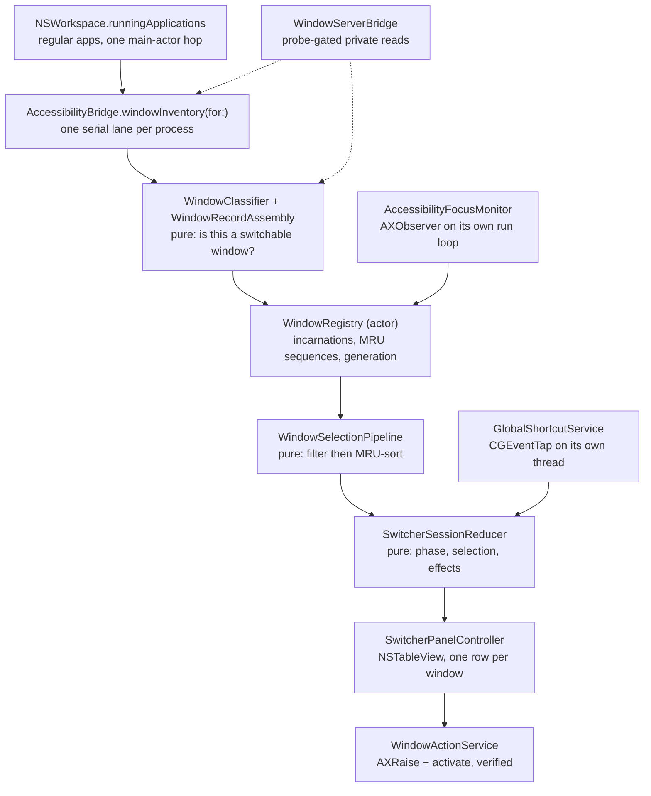

# Tab-List Codebase Overview

A map of the source tree for someone who has to change it. For *what* the
product does and why, see [IMPLEMENTATION_PLAN.md](../IMPLEMENTATION_PLAN.md).

## Shape of the project

Two Swift modules, one fixture app, one benchmark executable.

| Target | Kind | Lines | Depends on |
|---|---|---:|---|
| `TabListCore` | Framework | ~1,100 | Foundation, CoreGraphics, CryptoKit |
| `TabList` | Application | ~8,300 | `TabListCore`, AppKit, SwiftUI, ApplicationServices, Carbon, Sparkle |
| `WindowFixture` | Application | ~480 | AppKit |
| `TabListCoreBenchmarks` | Executable | ~200 | `TabListCore` |

The split is a hard rule, not a preference: **`TabListCore` contains no
framework object that is not `Sendable`.** An `AXUIElement` or `NSImage` never
enters a domain record. That is what lets the whole decision layer — what
counts as a window, what the user sees, what a keypress does — be tested
without a running Mac session.

```
Sources/
  TabListCore/
    Domain/        WindowKey, WindowRecord, WindowSnapshot, WindowActionTarget
    Windows/       WindowClassifier, WindowFilter, MRUOrdering
    Switcher/      SwitcherSessionReducer            ← the session state machine
    Layout/        PanelLayoutCalculator, SelectionScrollPlanner
    Settings/      TabListSettings, SettingsPersistence
    Shortcut/      ShortcutDefinition, ShortcutValidator
    Icons/         AppIconFingerprint
    Diagnostics/   PrivacyRedaction
    Services/      WindowActionResult and the provider protocols

  TabList/
    App/           TabListApplication, SwitcherSessionCoordinator,
                   SettingsStore, SettingsTransaction, UpdateController,
                   SwitcherOpeningCandidates, Observability
    Services/      AccessibilityBridge, WindowServerBridge, WindowInventory,
                   WindowRegistry, WindowActionService, GlobalShortcutService,
                   AccessibilityFocusMonitor, PermissionService, AppIconCache,
                   LaunchAtLoginService, DiagnosticsService,
                   WindowIdentityTable, NativeTabCollapse
    UI/            SwitcherPanelController, SwitcherRowView,
                   SwitcherDisplayItem, SettingsView, SettingsViewModel,
                   OnboardingView, MenuBarController, ShortcutRecorderView,
                   DebugInspectorWindowController (Debug only)
```

## The one path that matters

Everything the product does hangs off one pipeline: *find the windows, order
them, show them, activate one*.



Read that top to bottom and you have the app. Everything else is settings,
onboarding, packaging, or diagnostics.

## Key decisions encoded in the code

### Accessibility is the source of truth

Windows come from `kAXWindowsAttribute` — the same API used to raise and close
them. A window in the list is therefore always a window Tab-List can act on,
including windows on other Spaces, in hidden applications, and minimized.

`CGWindowListCopyWindowInfo` is called exactly once per discovery, and only to
rank processes front-to-back (`ProcessStackingOrder`). It is never used to
decide whether a window exists.

### Identity survives refreshes or nothing works

`WindowIdentityTable` maps an `AXUIElement` to the identifier it was first
given, keyed by `CFEqual`. Selection, MRU order, and a pending close all hang
off that stability. Two identity sources coexist inside one process:

| Source | When | Range |
|---|---|---|
| `.windowServerID` | `_AXUIElementGetWindow` probed successfully | real WindowServer ids |
| `.accessibilityOrdinal` | otherwise | `0x8000_0000` and up |

The ordinal base is above every realistic WindowServer id, so the two can never
collide. `invalidate(pid:)` drops cached *elements*; only `forget(pid:)`, called
when a process terminates, drops the identity table.

### Everything fails open

A rule that cannot evaluate its input keeps the window rather than hiding it.
Unknown subrole, unknown Space, unknown display, empty visible-Space set — all
of them widen the list instead of narrowing it. The previous implementation
failed *closed* on identity ambiguity and silently erased whole applications;
that inversion is the single most important behavioural change in the codebase.

### Private symbols are probe-gated and read-only

`WindowServerBridge` is the only file that calls `dlsym`. Four symbols, all
read-only, each enabled only after a harmless probe that can be checked against
a public source of truth. No private entry point mutates window, focus, or
Space state — activation is `AXRaise` plus `NSRunningApplication.activate()`.

### Pure state machine, impure edges

`SwitcherSessionReducer` is
`(inout State, Action) -> [Effect]`. It owns phases, selection, wrapping,
cycles queued before preparation finishes, pending closes, and registry
updates. `SwitcherSessionCoordinator` performs the effects and owns the tasks.
Every transition is testable without AppKit, which is why the reducer suite is
the largest test file in the repo.

## Threading model

This is the part that bites newcomers. Five execution contexts:

| Context | Owns | Rule |
|---|---|---|
| Main actor | AppKit, panel, settings, menu bar, coordinator | Never blocks on AX or WindowServer |
| `WindowRegistry` actor | Snapshots, MRU, incarnations, generation | Single writer for window state |
| Per-process serial queues | All Accessibility IPC | One slow app times out in its own lane |
| Event-tap thread | `CGEventTap` run loop | Callback stays minimal, hands a command to the main actor |
| AX observer thread | `AXObserver` run loop | Delivers only pid-scoped events |

Two supporting queues: `WindowServerBridge` runs its probes on a dedicated
serial queue (they make synchronous AX calls and must not block a cooperative
thread), and `AppIconCache` writes PNGs from detached tasks.

## Where to change what

| To change… | Edit | And test in |
|---|---|---|
| Which windows appear | `WindowClassifier`, `WindowRecordAssembly` | `WindowClassificationTests`, `WindowRecordAssemblyTests` |
| Which windows the user's settings hide | `WindowFilter` | `WindowFilteringTests` |
| Ordering | `MRUOrdering`, `WindowRegistry` | `MRUOrderingTests`, `WindowRegistryLifecycleTests` |
| Keys and cycling | `ShortcutEventInterpreter`, `SwitcherSessionReducer` | `ShortcutEventInterpreterTests`, `SwitcherSessionReducerTests` |
| Row contents | `SwitcherRowView`, `SwitcherDisplayItem` | `SwitcherDisplayItemTests` |
| Panel size and scrolling | `PanelLayoutCalculator`, `SelectionScrollPlanner` | `PanelLayoutTests`, `SelectionScrollPlanTests` |
| Activation or close behaviour | `WindowActionService`, `WindowClosePolicy` | `WindowClosePolicyTests` |
| Preferences | `TabListSettings`, `SettingsPersistence`, `SettingsStore` | `SettingsTests`, `SettingsStoreTests` |
| Private capability use | `WindowServerBridge` only | `WindowServerCapabilityReportTests` |

If a change lands in `Sources/TabList/Services` and has no matching test, ask
whether the decision can move into a pure type first. That is how
`WindowRecordAssembly`, `NativeTabCollapse`, `WindowIdentityTable`,
`ProcessStackingOrder`, and `DisplayGeometry` came to exist.

## Test layout

| Suite | Target | Covers |
|---|---|---|
| `TabListCoreTests` | `TabListCore` | Classification, filtering, MRU, reducer, settings, layout, shortcut validation, redaction |
| `TabListTests` | `TabList` | Identity, tab collapse, record assembly, geometry, registry lifecycle, close policy, settings store, permissions, panel selection, diagnostics |
| `TabListUITests` | app bundle | Accessory lifetime, onboarding copy, settings sections |
| `WindowFixtureUITests` | fixture | Fixture window scenarios |

`swift test` runs the two unit suites without Xcode. The UI suites need an
interactive session — they cannot initialise from a non-interactive shell.

## Things that are deliberately absent

- No screen capture. No `ScreenCaptureKit` link, no Screen Recording prompt.
- No thumbnail or icon-grid presentation. The list is the product.
- No private activation call. Cross-Space switching is public API.
- No build allowlists for private symbols. Runtime probes replaced them.
- No persistence of window identifiers or MRU state across launches.
