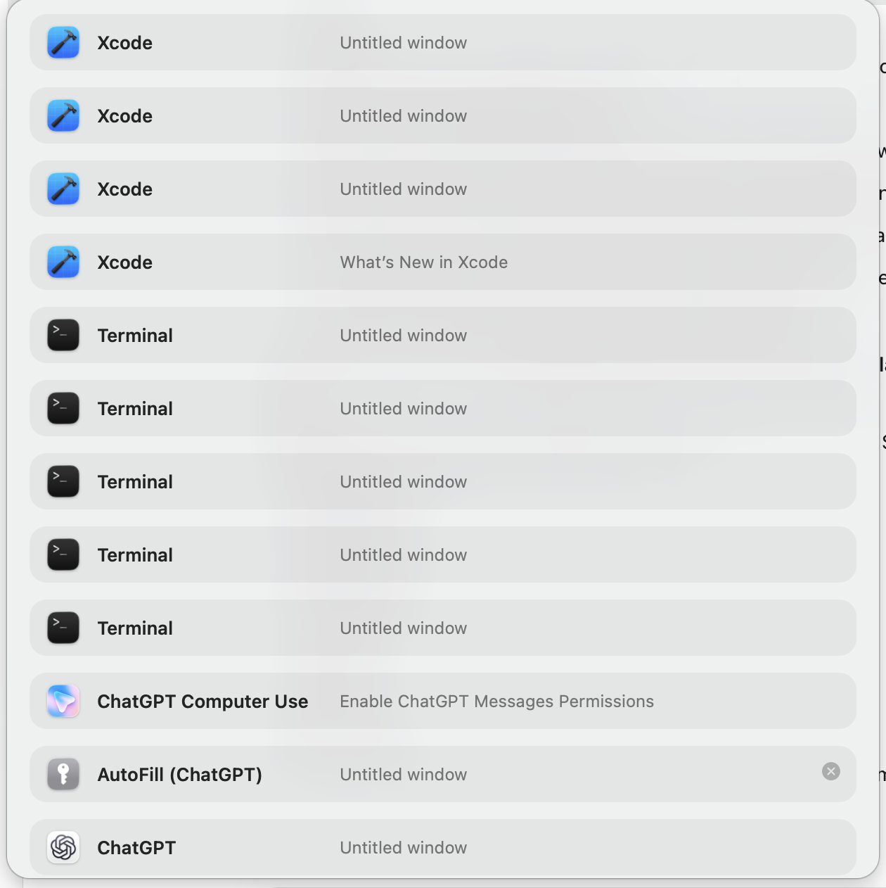
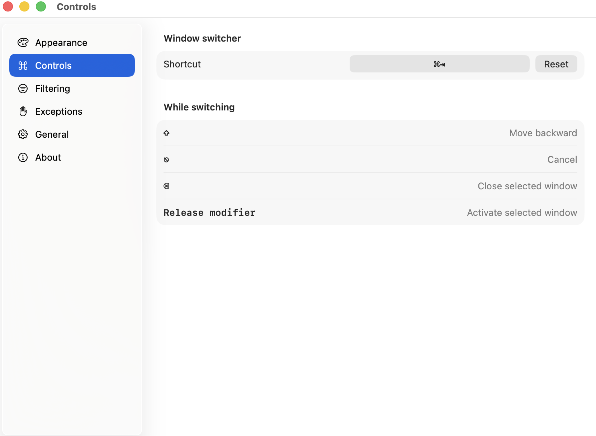
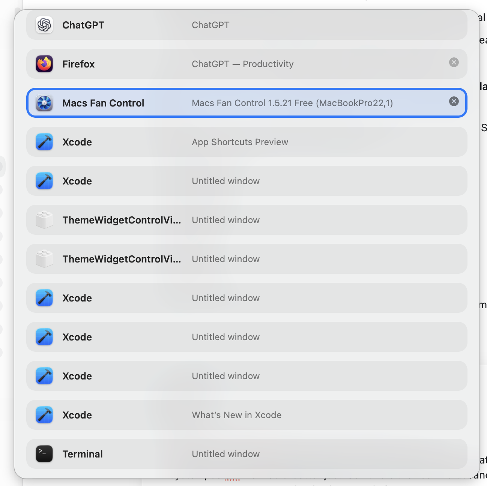
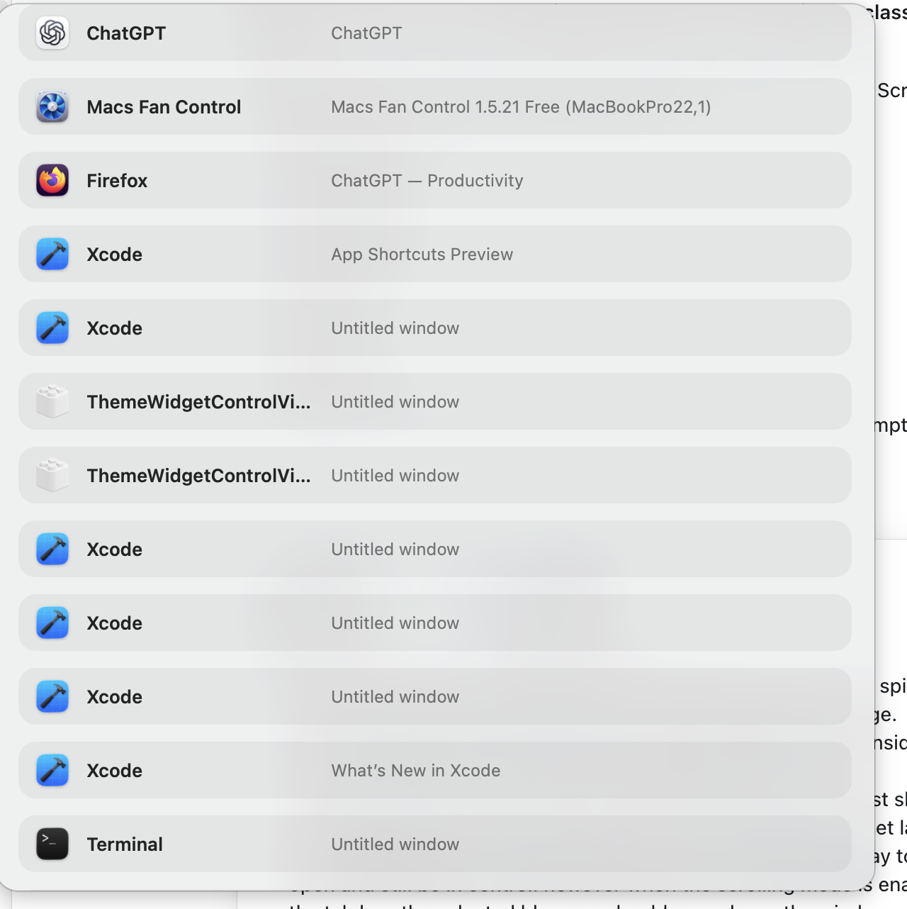

# Tab‑List Title Mode — Internal Alpha Product Review

| Field | Value |
|---|---|
| Review status | Draft accepted for engineering triage |
| Review date | 31 July 2026 |
| Product surface | Global window switcher, Titles presentation, Controls settings |
| Build under review | `1.0.0 (1)` local Debug build |
| Source baseline | `546320412766` plus local Xcode project-signing correction |
| Test environment | macOS 26.2, Apple Silicon, Xcode 26.6 |
| Evidence | Four user-provided screenshots and direct hands-on feedback |
| Review type | Combined product, interaction, visual, accessibility-risk, and release-readiness review |
| Intended audience | Product, macOS engineering, design, QA, release engineering |
| Release recommendation | **No-go for public release; go for continued internal alpha** |

## 1. Executive Summary

The first native build validates the central Tab‑List concept: the global
switcher opens, individual windows appear as separate candidates, selection is
visible, Delete can close windows, and the Titles presentation is already
usable enough to evaluate on real hardware.

The alpha also exposes four release-blocking failures in the core Titles
workflow:

1. Reverse keyboard navigation does not behave as expected.
2. Delete intermittently dismisses the Tab‑List panel when the session should
   continue.
3. Helper processes, view services, and other non-user windows pollute the
   candidate list.
4. Selection can leave the visible scroll viewport, removing the user's sense
   of position and control.

Adaptive sizing, consistent outer spacing, the opacity model, and performance
confidence are also not ready for release. The thermal observation is a valid
release risk, but it is not yet evidence of a production performance defect:
the session was run through Xcode in a Debug build while Xcode was also
building, indexing, and attaching a debugger.

The recommended next milestone is **Titles Mode Alpha 2**. It should focus on
candidate correctness, deterministic keyboard behavior, session continuity,
and adaptive scrolling before visual polish or work on the other two
presentation modes.

## 2. Scope

### Included

- Opening the global Tab‑List switcher.
- Forward and reverse keyboard navigation.
- Window candidate quality.
- Delete-to-close behavior.
- Titles-mode panel sizing and scrolling.
- Panel spacing and opacity.
- Initial performance and thermal risk.
- Local Debug-build application identity.
- Controls settings as they explain the switcher interaction.

### Excluded

- Thumbnail-mode image quality, capture behavior, and Screen Recording flow.
- App Icons mode layout and same-app disambiguation.
- Final visual branding.
- Cross-Space and multi-display activation parity.
- VoiceOver conformance testing.
- Release signing, notarization, Sparkle update delivery, and public packaging.

The excluded presentation modes require separate reviews because they
introduce different layout, capture, memory, and identification problems.

## 3. User Goal

The user should be able to hold the configured modifier, cycle through only
real user-facing macOS windows, keep the selected window visibly anchored in
the panel, optionally close a window without losing the switching session, and
release the modifier to activate the intended window.

The interaction must feel predictable enough to replace the native
application-level `Command-Tab` workflow.

## 4. Current Strengths

- The app successfully intercepts the configured global shortcut.
- Individual windows can appear independently instead of being collapsed into
  one application icon.
- The overlay can remain nonactivating while the underlying application stays
  active.
- App icons, application names, and window titles create a workable
  information hierarchy.
- The selected row has a strong system-accent outline.
- Close controls are exposed for at least some closable windows.
- The Titles mode avoids thumbnail capture and is the right surface for the
  lowest-resource configuration.
- The maximum-height concept and native scroll container are already present,
  even though selection tracking is not yet reliable.

## 5. Evidence Walkthrough

### Step 1 — Inspect a long candidate list

**Health: Unhealthy**

The long list contains several likely non-user candidates, including
`ChatGPT Computer Use`, `AutoFill (ChatGPT)`, and multiple untitled windows
that do not correspond to intentionally opened primary windows. No selected
row is visible in this captured viewport, matching the reported loss of
selection during keyboard cycling.

### Step 2 — Review the documented controls

**Health: At risk**

The Controls view displays the Shift key by itself as “Move backward.” This
creates the expectation that pressing Shift alone advances the selection in
reverse. The intended native-style contract is more precise: hold the base
modifier and press **Shift-Tab** to move backward.

The same view confirms that Delete is intended to close the selected window,
not to dismiss the switcher.

### Step 3 — Navigate inside an overflowing list

**Health: Unhealthy**

The selected row is visually clear when it is present, but the list includes
two `ThemeWidgetControlViewService` candidates and several low-value untitled
Xcode windows. The user reports that continued navigation can move the
selection beyond the displayed rows instead of moving the viewport with it.

### Step 4 — Inspect panel geometry

**Health: Needs refinement**

The first row sits much closer to the panel's top edge than rows sit to the
left or right edges. The uneven inset makes the panel look clipped at the top
and weakens the rounded container.

## 6. Priority Model

| Priority | Meaning |
|---|---|
| P0 | Blocks public release or makes the core switching task unreliable |
| P1 | Material usability, accessibility, or perceived-quality problem |
| P2 | Important clarification or polish that can follow core stabilization |
| P3 | Optional enhancement |

## 7. Findings Register

| ID | Priority | Area | Finding | Evidence confidence | Proposed owner |
|---|---:|---|---|---|---|
| TLAR-001 | P0 | Keyboard | Reverse cycling does not work as expected | Direct user report; settings screenshot confirms ambiguous instruction | Input and session |
| TLAR-002 | P0 | Window actions | Delete intermittently dismisses the switcher | Direct user report | Session and window actions |
| TLAR-003 | P0 | Candidate quality | Helper/view-service/background windows are included | Screenshot-confirmed | Registry and classification |
| TLAR-004 | P0 | Scrolling | Keyboard selection can leave the visible viewport | Direct user report; screenshot shows a long active list without a visible selection | Panel and layout |
| TLAR-005 | P1 | Layout | Auto sizing does not sufficiently adapt to candidate count | Direct user report | Panel and layout |
| TLAR-006 | P1 | Visual | Top outer inset is inconsistent with side insets | Screenshot-confirmed | Panel |
| TLAR-007 | P1 | Appearance | Transparency reduces clarity and adds an unproven configuration/performance cost | Screenshot-confirmed clarity risk; performance impact unverified | Design and performance |
| TLAR-008 | P0 gate | Performance | Lightweight behavior has not been proven on a Release build | Thermal spike reported; root cause unverified | Performance and release |
| TLAR-009 | P2 | Identity | Tab‑List is not perceived as a normal application in the local build | Direct user report; exact macOS surface not yet identified | App shell and release |

## 8. Detailed Findings and Acceptance Criteria

### TLAR-001 — Reverse keyboard navigation

**Observed**

The user cannot reliably move backward or upward using Shift. The Controls
screen labels Shift alone as “Move backward,” which is ambiguous and likely
contributes to the mismatch between expected and implemented behavior.

**Recommended interaction contract**

- With a session open and the base modifier held, `Tab` moves forward exactly
  one candidate.
- With a session open and the base modifier held, `Shift-Tab` moves backward
  exactly one candidate.
- Shift alone changes direction state but does not move selection.
- Key repeat follows the macOS repeat cadence.
- Both directions wrap at the beginning and end.
- The Controls screen displays **Shift-Tab — Move backward**, not Shift alone.

This is the recommended native-style behavior. Supporting Shift alone as a
backward step would be a separate product decision and is not recommended
because a modifier press should not silently perform an action.

**Acceptance criteria**

- Forward and backward traversal pass with 2, 10, and 100 candidates.
- Alternating `Tab` and `Shift-Tab` never skips or duplicates a step.
- Reverse traversal works on the first invocation and during key repeat.
- Releasing Command after reverse traversal activates the highlighted window.
- Escape after reverse traversal restores the original focus.
- The Controls screen and VoiceOver description state the exact chord.

**Likely implementation touchpoints**

- `Sources/TabList/Services/GlobalShortcutService.swift`
- `Sources/TabList/App/SwitcherSessionCoordinator.swift`
- `Sources/TabListCore/Switcher/SwitcherSessionReducer.swift`
- `Sources/TabList/UI/SettingsView.swift`

### TLAR-002 — Delete dismisses the switcher

**Observed**

Delete usually closes the selected window, but the Tab‑List panel often closes
at the same time.

**Expected behavior**

- A successful close removes one window and keeps the panel open.
- Selection moves to the item now occupying the same index, or to the previous
  item when the last row was closed.
- An unclosable window produces a subtle beep and keeps the panel open.
- The panel may dismiss only when:
  - no eligible candidates remain;
  - the target app presents a confirmation or unsaved-document sheet;
  - Accessibility permission is lost;
  - the session is otherwise cancelled for safety.

**Investigation requirements**

Record which close-result branch caused every dismissal:
`success`, `targetMissing`, `confirmationRequired`, `permissionDenied`,
`unsupported`, `timedOut`, or `failed`. The diagnostics must not log window
titles.

Check for a race between:

- AX close completion;
- registry reconciliation;
- the asynchronous list reload;
- modifier release;
- the panel-dismiss effect;
- stale or temporarily empty registry snapshots.

**Acceptance criteria**

- Close 20 ordinary Finder, TextEdit, Terminal, Firefox, Xcode, and Electron
  windows without an unintended panel dismissal.
- Closing the first, middle, and last row preserves a valid visible selection.
- Closing an unclosable window never quits its application or dismisses the
  panel.
- A real unsaved-document confirmation dismisses Tab‑List and activates the
  correct app.
- Delete remains consumed by Tab‑List and does not reach the selected app
  during an active session.

### TLAR-003 — Helper and background windows pollute the list

**Observed**

The screenshots include `ThemeWidgetControlViewService`, `ChatGPT Computer
Use`, `AutoFill (ChatGPT)`, and numerous untitled windows. These are not all
independently chosen primary windows and make the list substantially longer
than the user's actual workspace.

**Product rule**

Tab‑List lists independently switchable, user-facing top-level windows—not
processes, XPC services, background tasks, invisible surfaces, inactive native
tabs, popovers, previews, or helper panels.

**Recommended classification approach**

Do not solve this using titles or a growing blocklist of process names.
Classification should combine:

- WindowServer layer, alpha, geometry, tags, and on-screen state;
- AX role, subrole, parent relationship, focusability, and close capability;
- application activation policy;
- `LSUIElement` and background-only metadata;
- bundle identifier and host/child process relationship;
- whether the surface can actually become the focused main window;
- documented, narrowly scoped exceptions only when general signals are
  insufficient.

AX-only reconciliation must not reintroduce a window that WindowServer or the
primary classifier already rejected.

**Acceptance criteria**

- `ThemeWidgetControlViewService`, `CursorUIViewService`, AutoFill services,
  menu extras, popovers, tooltips, preview services, and drag surfaces do not
  appear.
- Real Firefox, Safari, Chrome, Finder, Terminal, Xcode, TextEdit, and Electron
  top-level windows remain available.
- Three real Firefox windows appear as three candidates.
- An inactive browser or native tab does not appear as a separate window.
- A standard untitled document window remains eligible.
- A utility palette and background-only helper remain excluded.
- Every rejected candidate exposes a redacted diagnostic reason.

**Likely implementation touchpoints**

- `Sources/TabListCore/Windows/WindowClassification.swift`
- `Sources/TabList/Services/PublicWindowInventory.swift`
- `Sources/TabList/Services/AccessibilityBridge.swift`
- `Sources/TabList/Services/WindowRegistry.swift`

### TLAR-004 — Selection leaves the scroll viewport

**Observed**

When the list exceeds the maximum panel height, continued keyboard traversal
can move the selected blue row beyond the displayed portion of the list.

**Required behavior**

- The selected row is always fully visible.
- The viewport does not jump while selection remains within a central comfort
  zone.
- Moving forward past the lower comfort boundary scrolls the content so the
  selected row returns toward the vertical center.
- Moving backward past the upper comfort boundary behaves symmetrically.
- At the first and last candidates, scrolling clamps naturally to the content
  edges.
- Wraparound immediately reveals the new selected row.
- Mouse hover never changes keyboard selection.

**Recommended scroll model**

Use a selection-following comfort zone covering approximately the middle
60 percent of the viewport. Keep at least one full row of context above and
below where content permits. A nearest-edge reveal is a safety fallback, not
the primary keyboard-scrolling behavior.

**Acceptance criteria**

- For lists of 15, 50, and 100 candidates, the selected row is fully visible
  after every forward and backward input.
- Selection remains visible during system key repeat and rapid input bursts.
- Wraparound from first to last and last to first reveals the destination
  immediately.
- List updates and window deletion preserve the selected key and reveal its
  new location.
- Tests cover 1× and 2× backing scale and every panel size.

### TLAR-005 — Adaptive panel sizing

**Observed**

The panel does not feel sufficiently responsive to the number of candidates.
A short list should use a compact window; the panel should grow as candidates
are added and only introduce scrolling after reaching its maximum size.

**Recommended Titles-mode sizing contract**

1. Calculate intrinsic height from visible rows, row spacing, and equal outer
   insets.
2. For a list that fits, set panel height to intrinsic height and do not show a
   vertical scroller.
3. Grow the panel with candidate count until the configured maximum—currently
   72 percent of the pointer display's visible frame.
4. At the maximum, keep panel geometry stable and enable selection-following
   scrolling.
5. After closing windows, shrink the panel smoothly once the candidate list
   fits again.

For Titles mode, adaptive height is recommended while width remains stable
within the selected size preset. Dynamically changing width during navigation
would cause lateral jitter. If “Auto” should also select compact, standard, and
wide width buckets, that should be decided separately after the height
behavior is correct.

**Acceptance criteria**

- Validate panel geometry at 1, 2, 5, 10, 25, 50, and 100 candidates.
- No empty vertical area remains beneath a short list beyond the required
  outer inset.
- The panel never exceeds the pointer display's visible frame or maximum
  height.
- The vertical scroller appears only when content overflows.
- Adding or closing one candidate does not cause repeated resize oscillation.

### TLAR-006 — Uneven top border and spacing

**Observed**

The top row is visibly closer to the panel edge than the left and right row
edges are to their respective panel edges.

**Required geometry**

- Outer content inset: 16 points on all four sides.
- Row gap: 12 points.
- Panel corner radius: 16 points.
- Row/selection corner radius: 12 points.
- The first and last rows must not intersect the rounded panel corners.

**Acceptance criteria**

- Snapshot tests measure equal top, left, bottom, and right outer insets within
  one pixel at 1× and two pixels at 2×.
- Insets remain correct with and without a visible overlay scroller.
- Insets remain correct in Light, Dark, and Reduce Transparency states.

### TLAR-007 — Transparency and opacity model

**Observed**

The 70–100 percent opacity slider creates configuration complexity, and the
current translucent surface allows underlying content to compete with row
labels. We suspect this to increase the compute requirements.

**Evidence judgment**

The readability concern is visible. The performance concern is plausible but
unproven. Setting an `NSVisualEffectView` to 100 percent alpha does not itself
make the material opaque or eliminate blur/compositing work.

**Recommended decision for the next alpha**

- Make **Opaque** the default.
- Use an actual semantic opaque background; do not treat 100 percent material
  alpha as equivalent to an opaque background.
- Remove the continuous slider from the primary Appearance settings.
- If translucency remains desirable, expose a simple
  **Opaque / Translucent** choice under Advanced settings only after Release
  measurements show that it stays within the energy budget.
- Always force the opaque path when Reduce Transparency is enabled.

**Acceptance criteria**

- Default Titles mode remains readable over both high-contrast and detailed
  underlying windows.
- Opaque mode does not instantiate or render a live visual-effect material.
- Changing appearance never initializes thumbnail capture in Titles mode.
- Appearance choice has automated persistence and migration coverage.
- Release-build measurements compare opaque and translucent configurations
  before translucency is approved for 1.0.

### TLAR-008 — Lightweight and thermal behavior

**Observed**

The machine temperature spiked several times during initial use.

**Current interpretation**

This is a release-gating signal, not yet a confirmed Tab‑List regression. The
observation occurred during a first Xcode Debug run, when build compilation,
indexing, package processing, debugger attachment, cache warming, and Tab‑List
startup could all contribute.

**Measurement protocol**

Measure a standalone optimized Release build after a five-minute warm-up:

| Scenario | Duration | Required evidence |
|---|---:|---|
| Hidden idle, Titles mode | 5 minutes | Average CPU, wakeups, memory, energy impact |
| Open/cycle/close burst | 100 sessions | P50/P95 appearance, selection latency, CPU, allocations |
| Sustained navigation | 60 seconds | CPU, main-thread time, event-tap duration |
| Registry stress | 10/50/100 windows | Reconciliation duration and memory |
| Post-dismissal | 60 seconds | Work returns to idle; no capture or polling leak |
| Launch | Cold and warm | CPU attribution for initialization and cache warming |

Use Instruments Time Profiler, Allocations, Energy Log, Points of Interest, and
`os_signpost` intervals. Record Xcode, Spotlight, and other concurrent CPU
separately.

**Release thresholds**

- Idle CPU averages below 0.5 percent.
- Selection completes inside one 16 ms frame.
- Cached overlay appearance P95 remains below 75 ms.
- Titles-mode memory remains below 60 MB with 50 windows.
- No ScreenCaptureKit or thumbnail capture work occurs in Titles mode.
- Background work returns to idle within one second after panel dismissal.
- No sustained thermal escalation is attributable to Tab‑List during the
  Titles-mode workload.

### TLAR-009 — Application recognition

**Observed**

The local build is not perceived as a normal application.

**Interpretation**

Several behaviors are intentional:

- Tab‑List is an accessory application (`LSUIElement`) and therefore has no
  normal Dock icon.
- Tab‑List excludes its own windows from its switcher.

A local ad-hoc Debug build can also have less stable identity in macOS privacy
settings than a Developer ID-signed application, particularly when its build
path or signature changes.

**Expected final behavior**

- Tab‑List does not appear in its own candidate list.
- Tab‑List does not appear in native `Command-Tab`.
- Tab‑List is visible as an app bundle in Finder and as a process in Activity
  Monitor.
- Tab‑List appears with a stable name and icon in Accessibility and Screen
  Recording settings after the signed application is installed.
- Relaunching the same signed build does not create duplicate privacy entries.

The exact surface where recognition is missing must be captured before this is
treated as a defect.

## 9. Accessibility Risks

The screenshots and user report identify the following risks; they do not
establish full accessibility compliance or noncompliance.

- A selected item leaving the viewport removes the primary visible state cue.
- Transparency can reduce effective text contrast depending on the underlying
  window.
- The Shift-only control legend does not accurately communicate the required
  chord.
- Intermittent dismissal after Delete is an unexpected context change.
- Truncated service names are not useful labels and further increase the cost
  of navigating with VoiceOver.
- Close controls must retain at least a 24×24-point hit target even when
  visually compact.
- Every list update must preserve logical VoiceOver position, selected state,
  and “x of y” count.

Required follow-up testing includes VoiceOver traversal, Increase Contrast,
Reduce Transparency, Reduce Motion, Full Keyboard Access, rapid key repeat,
and alternative keyboard layouts.

## 10. Proposed Product Decisions

| Decision | Recommendation | Status |
|---|---|---|
| Reverse navigation | Use `Shift-Tab`; Shift alone does not move selection | Proposed |
| Controls copy | Display the complete key chord | Proposed |
| Default background | Opaque semantic background | Proposed |
| Opacity slider | Remove from primary settings; reconsider under Advanced after measurement | Proposed |
| Titles-mode growth | Adaptive height, stable preset width | Proposed |
| Overflow behavior | Maximum 72% display height plus selection-following scroll | Reaffirmed with stronger acceptance criteria |
| Candidate definition | Only independently user-switchable top-level windows | Reaffirmed |
| Helper filtering | Signal-based, not title/name blocklists | Reaffirmed |
| Tab‑List in its own list | Always excluded | Reaffirmed |
| Public release | Block until all P0 findings and performance gate pass | Proposed |

## 11. Engineering Sequence

### Milestone A — Core reliability

1. Reproduce and fix reverse cycling.
2. Correct Controls copy and accessibility descriptions.
3. Add close-result diagnostics and reproduce Delete dismissal.
4. Make close-session continuity deterministic.

**Exit:** Forward, reverse, Escape, Delete, and modifier release pass the
keyboard acceptance suite.

### Milestone B — Candidate correctness

1. Capture redacted diagnostic metadata for every false-positive candidate.
2. Strengthen process and AX classification.
3. Prevent AX-only reconciliation from reintroducing rejected surfaces.
4. Add fixture and real-app regression cases.

**Exit:** The candidate list contains real user windows and none of the helper
classes identified in this review.

### Milestone C — Adaptive layout and scrolling

1. Correct equal panel insets.
2. Make short-list height intrinsic.
3. Introduce overflow only at maximum height.
4. Implement the selection comfort zone and wraparound reveal.
5. Add layout, snapshot, and interaction tests.

**Exit:** Selection remains visible for 1–100 candidates at all supported
display scales and sizes.

### Milestone D — Appearance and performance

1. Switch the alpha default to a true opaque background.
2. Simplify or defer translucency controls.
3. Profile an optimized standalone Release build.
4. Investigate only CPU work attributable to Tab‑List.

**Exit:** All existing product performance budgets pass with captured evidence.

### Milestone E — Re-review

Run a second hands-on Titles-mode review before beginning release polish or
using its component behavior as the foundation for App Icons and Thumbnail
mode fixes.

## 12. Acceptance Matrix for Titles Mode Alpha 2

| Area | Test | Pass condition |
|---|---|---|
| Open | 0 or 1 eligible candidate | No empty/useless panel |
| Open | 2–100 candidates | Correct second-MRU selection appears |
| Forward | Repeated `Command-Tab` | One step per event; wrap works |
| Reverse | Repeated `Command-Shift-Tab` | One backward step per event; wrap works |
| Cancel | Escape at every position | Original focus preserved |
| Commit | Release Command | Visible selected window activates |
| Close | Ordinary closeable window | One candidate removed; panel remains |
| Close | Last candidate | Panel dismisses safely |
| Close | Unclosable window | Beep; panel remains |
| Close | Confirmation sheet | Panel dismisses and owning app activates |
| Filtering | Xcode, ChatGPT, browser, Terminal stress set | No helper/view-service candidates |
| Layout | 1, 2, 5, 10 candidates | Intrinsic height; no unnecessary scroll |
| Layout | 25, 50, 100 candidates | Maximum height; scroll enabled |
| Scroll | Rapid forward/reverse | Selection always fully visible |
| Appearance | Detailed light/dark backgrounds | Default surface remains readable |
| Performance | Standalone Release workload | All stated budgets pass |
| Identity | Installed signed app | Stable icon/name in macOS permission panes |

## 13. Evidence Limits and Verification Gaps

- Screenshots cannot prove keyboard event delivery, key-repeat timing, close
  result branches, CPU attribution, memory use, or thermal causality.
- The review covers Light appearance only.
- The test was performed from Xcode with a Debug build rather than a
  standalone signed Release build.
- No exact diagnostic record was captured for the helper-window AX roles,
  subroles, bundle identifiers, or activation policies.
- The screenshot set does not identify which macOS surface failed to recognize
  Tab‑List as an application.
- VoiceOver, Reduce Motion, Reduce Transparency, Increase Contrast, multiple
  displays, multiple Spaces, Stage Manager, and macOS 15 remain unverified.

## 14. Code Areas to Inspect During Triage

- `Sources/TabList/Services/GlobalShortcutService.swift`
- `Sources/TabList/App/SwitcherSessionCoordinator.swift`
- `Sources/TabListCore/Switcher/SwitcherSessionReducer.swift`
- `Sources/TabList/UI/SwitcherPanelController.swift`
- `Sources/TabListCore/Layout/LayoutMetrics.swift`
- `Sources/TabListCore/Windows/WindowClassification.swift`
- `Sources/TabList/Services/PublicWindowInventory.swift`
- `Sources/TabList/Services/AccessibilityBridge.swift`
- `Sources/TabList/Services/WindowRegistry.swift`
- `Sources/TabList/UI/SettingsView.swift`
- `Sources/TabListCore/Settings/Settings.swift`

## 15. Review Outcome

The alpha is successful as a proof of the core product direction. It should
not be treated as a release candidate yet.

Public release remains blocked until:

- every P0 finding in this document is resolved and regression-tested;
- the Title-mode Release build passes the performance protocol;
- candidate filtering is validated against real system and third-party apps;
- the adaptive sizing and selection-following scroll behavior pass the
  acceptance matrix;
- the Titles mode receives a second hands-on product review.

